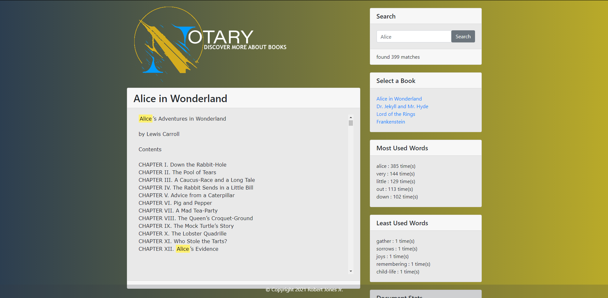

# Notary

## Description
``
Notary: A coding project for searching through text in javascript
``
## Table of- Contents
- [Questions](#Questions)
- [Description](#Description)
- [License](#License)
- [Live App Link](#Live-App-Link)
- [Mobile Screen Capture](#Mobile-Screen-Capture)
- [Screen Capture](#Screen-Capture)
- [Repository Link](#Repository)
- [Contributors](#Contributors) 

## Live App Link

- [Notary Demo](https://jones9682.github.io/Notary/)

# Mobile screen capture

# Screen Capture

## License

## Contributors
``
Bobby Jones Jr.
``
## Repository

- [Project Repo](https://github.com/jones9682/Notary)

## Questions

If you have any questions about the repo, open an issue or contact me directly at rjonesjr2891@gmail.com. You can find more of my work at my [GitHub Profile](https://github.com/jones9682).
